# E-Konekt Visual Diagrams

## 1. Entity Relationship Diagram (ERD)

## 2. User Flow - Sign Up & Onboarding

## 3. User Flow - Selling Products

## 4. User Flow - Creating Business & Posting Jobs

## 5. User Flow - Job Application Process

## 6. System Architecture Diagram

## 7. Data Flow - Product Creation (Dual Seller)

## 8. Access Control Matrix

```mermaid
graph LR
    subgraph "User Roles & Permissions"
        A[Regular User] --> A1[✓ Browse All]
        A --> A2[✓ Sell Individual]
        A --> A3[✓ Apply for Jobs]
        A --> A4[✓ Post Announcements]
        A --> A5[✗ Post Jobs]
        
        B[Business Owner] --> B1[✓ All User Permissions]
        B --> B2[✓ Sell as Business]
        B --> B3[✓ Post Jobs]
        B --> B4[✓ Manage Applications]
        B --> B5[✓ Business Announcements]
        
        C[Barangay Admin] --> C1[✓ All User Permissions]
        C --> C2[✓ Official Announcements]
        C --> C3[✓ Moderate Content]
        
        D[System Admin] --> D1[✓ All Permissions]
        D --> D2[✓ Manage Users]
        D --> D3[✓ System Config]
    end
    
    style A fill:#90CAF9
    style B fill:#81C784
    style C fill:#FFB74D
    style D fill:#E57373
```

## 9. Product Seller Type Decision Tree

## 10. Announcement Types & Targeting

## 11. Job Application State Machine

## 12. Database Trigger Flow

## 13. Complete System Lifecycle - Entity Relationships Across Platform

## 14. Platform Ecosystem - Complete Entity Interaction Map

```mermaid
graph TB
    subgraph "User Layer"
        U1[👤 Regular User]
        U2[👤 Business Owner]
        U3[👤 Barangay Admin]
    end
    
    subgraph "Core Entities"
        B[🏢 Business Profile]
        P1[📦 Individual Product]
        P2[📦 Business Product]
        J[💼 Job Posting]
        A1[📢 Personal Announcement]
        A2[📢 Business Announcement]
        A3[📢 Official Announcement]
    end
    
    subgraph "Interaction Entities"
        APP[📝 Job Application]
        TRANS[💰 Transaction]
        VIEW[👁️ Views/Engagement]
    end
    
    subgraph "Platform Data"
        MARKET[🛒 Marketplace]
        JOBS[💼 Jobs Board]
        COMM[📣 Community Feed]
    end
    
    %% User to Core Entities
    U1 -->|creates| P1
    U1 -->|submits| APP
    U1 -->|posts| A1
    U1 -->|views| MARKET
    U1 -->|views| JOBS
    U1 -->|views| COMM
    
    U2 -->|owns| B
    U2 -->|creates| P1
    U2 -->|creates via| P2
    
    B -->|posts| J
    B -->|lists| P2
    B -->|publishes| A2
    
    U3 -->|publishes| A3
    
    %% Interactions
    J -->|receives| APP
    APP -->|status updates| U1
    APP -->|reviewed by| U2
    
    P1 -->|listed in| MARKET
    P2 -->|listed in| MARKET
    MARKET -->|generates| TRANS
    
    J -->|listed in| JOBS
    
    A1 -->|shown in| COMM
    A2 -->|shown in| COMM
    A3 -->|shown in| COMM
    
    MARKET -->|tracked| VIEW
    JOBS -->|tracked| VIEW
    COMM -->|tracked| VIEW
    
    %% Lifecycle connections
    U1 -.upgrade.-> U2
    P1 -.can become.-> P2
    J -.when filled.-> APP
    
    style U1 fill:#81C784
    style U2 fill:#64B5F6
    style U3 fill:#FFB74D
    style B fill:#42A5F5
    style P1 fill:#FFA726
    style P2 fill:#FF7043
    style J fill:#AB47BC
    style APP fill:#EC407A
    style MARKET fill:#26A69A
    style JOBS fill:#7E57C2
    style COMM fill:#29B6F6
```

## 15. Timeline View - User Journey Through Platform

---

## How to View These Diagrams

### Option 1: GitHub/GitLab
- Push this file to GitHub/GitLab
- Mermaid diagrams render automatically

### Option 2: VS Code
- Install "Markdown Preview Mermaid Support" extension
- Open this file and preview

### Option 3: Online Viewers
- Copy diagram code to https://mermaid.live/
- Renders interactive diagrams

### Option 4: Export as Images
- Use mermaid-cli: `mmdc -i VISUAL_DIAGRAMS.md -o diagrams.pdf`
